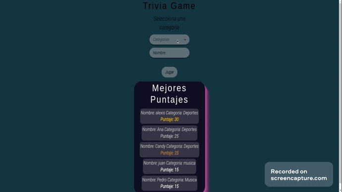

<h1> Trivia App React </h1>

<h2>Tecnologias Usadas:</h2>

    Para el servidor: Node, Express, y ASTRADB (base de datos), Axios
    Para el client: React, Redux, Chakra UI, SweetAlert2, Use-Sounds(Efectos de sonidos), Axios

<h2> Fork Repositorio </h2>

    - En el server hacer npm i y luego node index.js para correr el servidor en el puerto 4000

    - En el client hacer npm i y luego npm start para correr el client en el puerto 3000

    Configurar un archivo .env con URL , URLPOST, ASTRA_TOKEN

